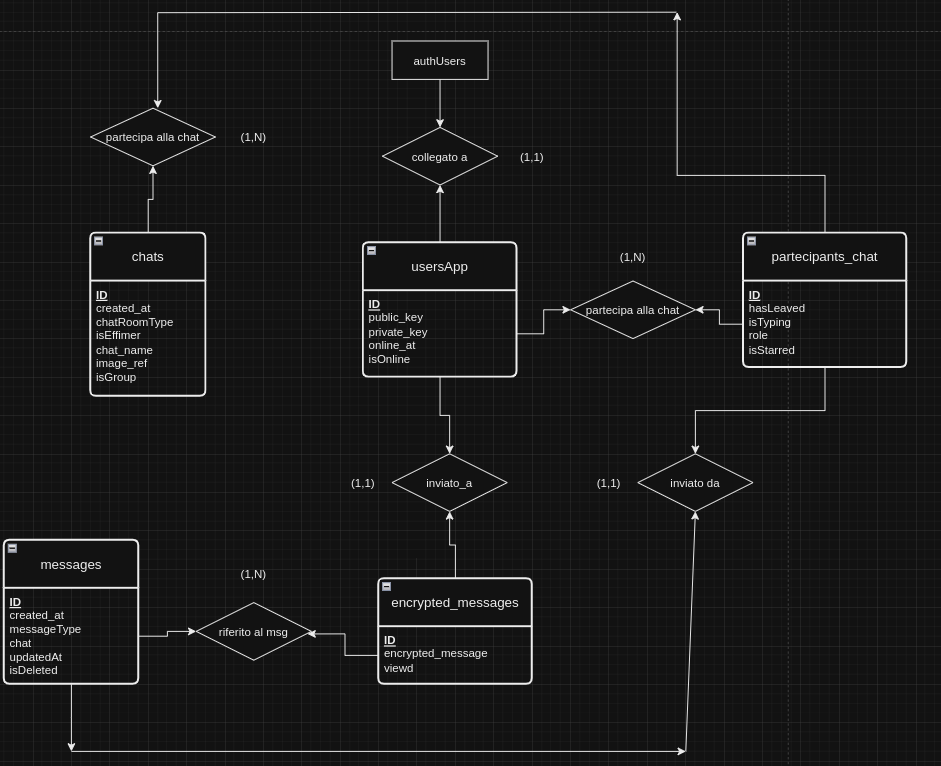

# This is a school project

the desktop app called **segretino** is a chat app made with the help of [supabase](https://supabase.com/), an BaaS (Back-end as a Service) like firebase.
Tauri is the best framework for make desktop app, the majority of applications is make with electronjs but the bundle size is more heavy, tauri use rust in back-end for interaction with OS and js for the frontend.

**demo app**

the app can be download [here](https://segretino-web-project.vercel.app)

# THE APP IS JUST AN ALPHA AND IS NECESSARY CODE REFACTORING AND IMPLEMENTATION OF FUNCTIONALITY THAT IS CURRENTLY MISSING

**above there is the database schema:**

# Features

1.  Real-time chat functionality
2.  User authentication via Supabase
3.  Message persistence in Supabase database
4.  Simple and intuitive UI
5.  End-to-end encryption (E2EE) with private and public keys for each user
